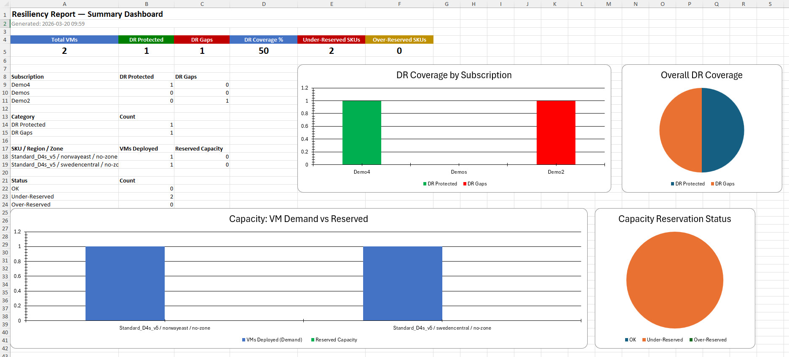

# Resiliency Report

PowerShell script that generates an Excel report covering VM disaster-recovery status, capacity-reservation utilisation, and availability-zone awareness across Azure subscriptions.



## Prerequisites

- **PowerShell 7+**
- **Az PowerShell modules**: `Az.Accounts`, `Az.ResourceGraph`
- **ImportExcel** module: `Install-Module ImportExcel -Scope CurrentUser`
- An authenticated Azure session (`Connect-AzAccount`)

## Usage

```powershell
# Specific subscriptions (GUIDs or names)
.\resiliency-report.ps1 -Subscriptions "sub1","sub2","sub3"

# With a shared capacity subscription that owns CRGs
.\resiliency-report.ps1 -Subscriptions "sub1","sub2" -SharedCapacitySubscriptionId "crg-owner-sub-id"

# All subscriptions under a management group
.\resiliency-report.ps1 -ManagementGroup "MyMG"

# With a shared capacity subscription that owns CRGs
.\resiliency-report.ps1 -ManagementGroup "MyMG" -SharedCapacitySubscriptionId "crg-owner-sub-id"


# Pipeline input
Get-AzSubscription | .\resiliency-report.ps1

# Custom output path
.\resiliency-report.ps1 -Subscriptions "sub1" -ExcelFile "C:\Reports\resiliency.xlsx"
```

## Parameters

| Parameter | Description |
|---|---|
| `-ExcelFile` | Output path (default: `./resiliency-report.xlsx`) |
| `-ManagementGroup` | Management group name/ID — includes all child subscriptions |
| `-Subscriptions` | One or more subscription GUIDs, names, or objects. Supports pipeline input |
| `-SharedCapacitySubscriptionId` | Subscription that owns shared Capacity Reservation Groups |
| `-IncludeSharedCapacityReservations` | Discover CRGs shared to target subscriptions (default: on) |

## Excel Sheets

| Sheet | Content |
|---|---|
| **Summary** | Dashboard with KPI boxes and 4 charts: DR coverage by subscription, overall DR pie, capacity demand vs reserved, capacity gap status |
| **SubscriptionSummary** | Per-subscription VM count, DR-protected count, capacity-reservation totals |
| **VMs** | Every VM with DR flag, CRG association, power state, logical & physical zone |
| **CapacityReservations** | CRG/CR details: SKU, provisioned vs consumed capacity, sharing info, zones |
| **DRGaps** | VMs without Site Recovery replication |
| **ZoneMappings** | Logical-to-physical zone mappings per subscription and region |
| **CapacityRecommendations** | Per SKU/region/physical zone: VM demand vs reserved capacity with gap analysis |

## Zone Mapping

Each Azure subscription has its own logical-to-physical availability zone mapping. The script queries the Azure locations API per subscription to resolve zones, ensuring that capacity recommendations correctly align VMs in one subscription with reservations in another (e.g. a shared management subscription).